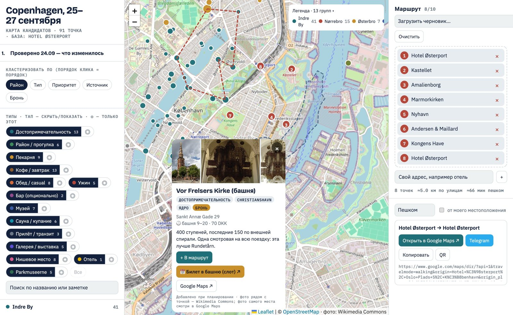
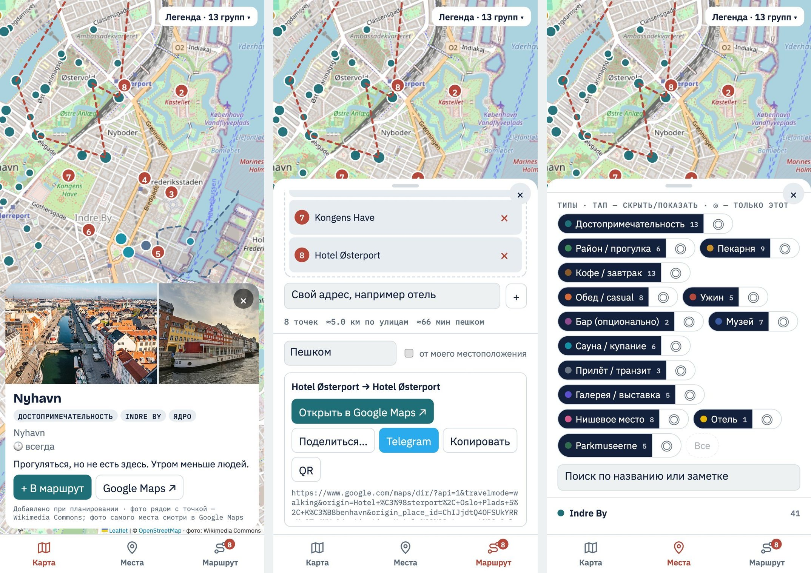

# trip-map

An [Agent Skill](https://docs.claude.com/en/docs/agents-and-tools/agent-skills) that turns a list of places for a
city trip into one self-contained, phone-friendly HTML map:

- places clustered by district / type / priority / source (combinable),
- tap cards with photos, hours for the trip days, what's on, booking / ticket buttons, Google Maps link,
- a drag-and-drop route of up to 10 stops → one Google Maps walking link, shareable via the system share sheet or straight to Telegram,
- bottom-sheet layout on phones, three-column layout on desktop, light/dark themes.

The AI agent does the research and writes `data.json`; the page is a fixed template. Born from planning a
weekend in Copenhagen — that trip is included as the example and as the live demo.

**Live demo:** [iamdrozdov.github.io/trip-map](https://iamdrozdov.github.io/trip-map/) — the Copenhagen example (open it on a phone too).





## Use as a skill

```bash
# Claude Code: make it available in every project
ln -s "$PWD" ~/.claude/skills/trip-map        # or copy the folder
# then just ask: "plan a weekend in Lisbon and make me a map of the places" — or /trip-map
```

`SKILL.md` tells the agent the workflow; `references/` hold the data schema and the research playbook.

## Use by hand

```bash
python3 scripts/build.py examples/copenhagen/data.json -o copenhagen.html
open copenhagen.html
```

```bash
python3 scripts/build.py data.json --check                     # validate only
python3 scripts/build.py data.json --artifact -o page.html     # body-only page for a Claude artifact
python3 scripts/fetch_basemap.py 55.645 12.49 55.725 12.65 -o basemap.json   # offline land/water/roads (needs shapely)
python3 scripts/build.py data.json --basemap basemap.json -o out.html
node scripts/check.mjs out.html                               # Playwright smoke test + screenshots
```

### Fully offline page

One HTML file with zero network requests: libraries, fonts, a vector map of the city (zoomable, light/dark) and up to 3
photos per place are embedded.

```bash
brew install pmtiles                                         # once
python3 scripts/fetch_offline_map.py data.json -o city.pmtiles
uv run --with pillow python scripts/build.py data.json --offline --map city.pmtiles -o trip.html
node scripts/check.mjs trip.html --offline                   # blocks all network and verifies map, photos, dark mode
```

The map covers the padded bounding box of the places (`--pad-km`, default 1.5) and a box around each `far` place, up to
zoom 15, and stays sharp when zoomed further. Expect 15-30 MB. Photos are picked at build time: `img` URLs from `data.json`, then
the Wikipedia page image, the Wikidata image and Commons category of `w`, then filtered Commons photos near the point.
Downloads are cached in `.cache/`. Google Maps, Telegram and booking buttons remain links and need internet.

Layout of `data.json`: see [`references/data-schema.md`](references/data-schema.md).

## How the page works

Leaflet 1.9 (OpenStreetMap tiles, optional embedded vector basemap), SortableJS for drag-and-drop, qrcodejs for the QR
button — all from cdnjs. Photos come live from Wikipedia (`w` = article title) and Wikimedia Commons
(geosearch around the point). Route, filters and clustering are kept in `localStorage`. No build step in the
browser, no tracking, no backend.

The Google Maps directions URL is built from the stops' `place_id`s (origin + up to 8 waypoints + destination),
travel mode walking by default.
